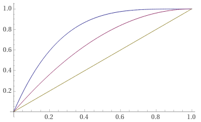

# Hungry Driven

This mod effect is a __Parabolic Soft-clipping Overdrive__.

## Maths behind the effect

Overdrive/distortion effects clip sound waves, making sine waves become squared.
There are 2 kind of clipping: "Soft", that gradually flattens the peaks of the
signal, and "Hard", that flattens peaks abruptly. Usually analog components, like
valves, are used.

In order to simulate this effect digitally, different functions can be used, from
trigonometrical ones to inverses. However here a simple 2-degree polynomial curve
is used to set the relation between input and output. The formula is:
__-x^2 + 2x__

Given the signal, with values from -1 to +1, the function is used to get the new
values. To make a harder effect, there is an option to make the signal passes up to 4
times thru the same effect.

This image shows the positive part of the effect (the negative values of the
signal are processed in a symmetric way).
* Yellow line shows no effect (input value = output value).
* Red line shows the overdrive effect with 1 single pass (that is, applies the formula).
* Blue line shows the effect with 2 passes.
Obviously, with 3 and 4 passes, the curve becomes harsher.

## Development instructions

Be sure first that you can "make" the example provided in the logue-sdk repository.
Then clone this repo, modifying the value of __PLATFORMDIR__ in the Makefile to match
the platform directory.
